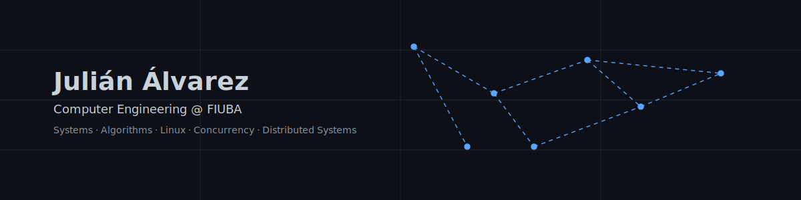

  

## About me

 

I’m interested in software development with a strong emphasis on quality, correctness, and good design principles.
I enjoy understanding the concepts behind building robust and maintainable software, from algorithms and data structures to concurrency and distributed systems.

My goal is to develop a broad engineering perspective, combining solid fundamentals with practical judgment to design reliable and scalable software systems.

  

 

## 

<h4> Languages </h4>
 
  
  
  
  
  
  
  

<h4> Other Tools and Technologies </h4>

  
  
  
  
  

